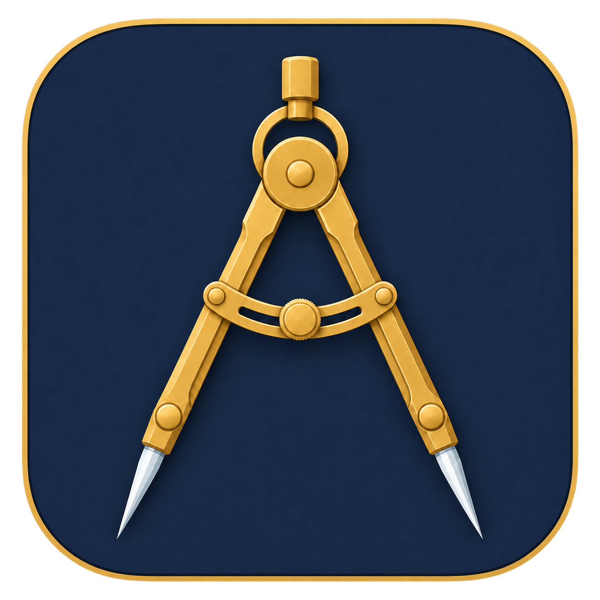
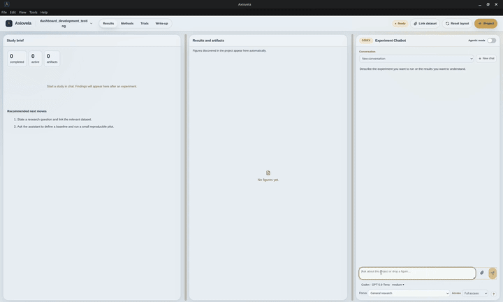

<p align="center"></p>

<h1 align="center">Axiovela</h1>

<p align="center"><strong>The AI research workbench.</strong><br />Turn a question into experiments, measured results, and a manuscript.</p>

<p align="center"><a href="https://github.com/CashBowman/axiovela/releases/tag/v0.2.5">Download</a> · <a href="docs/quick-start.md">Get started</a> · <a href="docs/features.md">Features</a> · <a href="docs/README.md">Documentation</a> · <a href="https://github.com/CashBowman/axiovela/releases/tag/v0.2.5">Release notes</a></p>



*A short end-to-end product demo.*

Axiovela keeps your code, data, figures, citations, and writing together in ordinary project files on your computer. Connect your AI provider, guide the work, and review the evidence at each step.

## Keep research moving in parallel

Run an experiment, develop a manuscript, and explore another project at the same time. **Axiovela 0.2.5 lets independent chats work concurrently**, so you can keep prompting and reviewing while other tasks continue in the background.

- **Research and write together.** Run the experiment assistant and writing assistant simultaneously.
- **Move freely between projects.** Switch tabs or start another conversation without interrupting active work.
- **Keep the next step ready.** Queue a follow-up in a busy conversation; it starts when that conversation's current turn finishes, even in a background tab.
- **Stay in control.** Follow task activity across projects and stop one chat independently.

Consecutive turns within one conversation stay ordered. Provider limits and available compute still apply, and assistants in the same project share its files. [How parallel chats work →](docs/parallel-chats.md)

## From question to manuscript

1. **Ask.** Define the question, hypothesis, and baseline with your assistant.
2. **Experiment.** Write and run code, recording methods, parameters, logs, and results.
3. **Evaluate.** Inspect measured outcomes, compare figures, and document limitations.
4. **Write.** Build a Markdown or LaTeX manuscript with linked figures and citations.

Use Codex, Claude Code, Gemini CLI, OpenCode, Pi, or a supported API connection. Each research assistant has its own model and conversation settings. Experimental Pi + Herdr Agentic mode can delegate independent work to bounded workers. [Connections and access modes →](docs/model-tools.md)

## Start with the desktop app

Axiovela runs in its own window on **Linux, Windows, and macOS**. The desktop app includes its runtime; no Git, Node, npm, or GitHub account is needed for the example and basic project management.

**Download Axiovela 0.2.5 · Stable release**

Downloads include the figure-edit fix: revise existing plots from saved results and see updated previews. Already installed 0.2.5? Download again and reinstall to get this refresh; the version number is unchanged.

**Windows**

<a href="https://github.com/CashBowman/axiovela/releases/download/v0.2.5/Axiovela-0.2.5-win32-x64-Setup.exe"></a>

[Windows ARM64 · portable ZIP](https://github.com/CashBowman/axiovela/releases/download/v0.2.5/Axiovela-0.2.5-win32-arm64.zip)

**macOS**

<a href="https://github.com/CashBowman/axiovela/releases/download/v0.2.5/Axiovela-0.2.5-darwin-arm64.dmg"></a>
<a href="https://github.com/CashBowman/axiovela/releases/download/v0.2.5/Axiovela-0.2.5-darwin-x64.dmg"></a>

**Linux**

<a href="https://github.com/CashBowman/axiovela/releases/download/v0.2.5/Axiovela-0.2.5-linux-x64.zip"></a>

[Linux ARM64 · portable ZIP](https://github.com/CashBowman/axiovela/releases/download/v0.2.5/Axiovela-0.2.5-linux-arm64.zip)

[Help choosing a download, portable ZIPs, and release notes](https://github.com/CashBowman/axiovela/releases/tag/v0.2.5)

Existing projects and settings remain compatible. Open **Help → Try the example study**, or choose **Project** and connect your provider below the chat composer.

[Installation and first session](docs/quick-start.md) · [Platform validation](https://github.com/CashBowman/axiovela/releases/tag/v0.2.5) · [Mac installation](docs/mac-installation.md)

## Develop on your Mac or Windows computer

The `main` branch includes the 0.2.5 release: concurrent chats across assistants and projects, background follow-up queues, responsive task status, a cleaner navigation header, guided update checks, and source/PDF exports. Three selectable [research profiles](docs/research-profiles.md) preserve domain-specific research instructions.

Clone this repository and follow [Development setup](docs/development-setup.md) for the exact Mac, Windows, and Linux commands, local packaging, and acceptance checks. GitHub desktop and multi-OS builds run only when manually requested. See the current release record for device reports and remaining acceptance checks.

## Prefer to run from source?

Install Git and **Node 22.12+ within Node 22**, then run:

```sh
git clone https://github.com/CashBowman/axiovela.git
cd axiovela
node scripts/install.mjs
axiovela
```

The command opens **http://127.0.0.1:8787**; keep the terminal running and use **Ctrl+C** to stop it. Keep the checkout in place because the command links to it. [Full source setup →](docs/quick-start.md#install-from-source)

For the standalone, dependency-free example, run `node examples/linear-regression/run.mjs` from the checkout. [Example walkthrough](examples/linear-regression/README.md) · [Manuscript workspace](docs/demo.md)

## Keep the science under your control

- **Portable work.** Projects use ordinary files and optional Git history.
- **Evidence first.** Check generated code, measurements, and citations before relying on a claim. [Research principles](docs/scientific-integrity.md)
- **Your provider.** AI connections use your account and may transmit project context or incur charges. Full access permits commands on your computer. [Security and privacy](SECURITY.md)
- **Optional research tools.** Markdown and math work immediately. The desktop app includes Tectonic for LaTeX PDFs; source installs need it separately. Python, GPUs, remote compute, and other tools depend on your experiment. [Setup](docs/quick-start.md#connect-ai-and-set-up-latex)

[Roadmap](docs/roadmap.md) · [Contributing](CONTRIBUTING.md) · [Troubleshooting](docs/troubleshooting.md) · [Changelog](CHANGELOG.md)

Free to use, modify, and share under the [MIT License](LICENSE), without warranty and subject to its liability disclaimer. Read the [beta notice](BETA_NOTICE.md) before use. Existing projects and the `methodflow` and `ml-workbench` commands remain compatible. [Branding and compatibility](docs/branding.md)


Version 0.2.5 preserves editable queued messages through errors and reopening, and lets Pi finish its own retries and context recovery. Version 0.2.4 can download and verify this update in the app; older installations need one manual upgrade. Installation remains manual.
