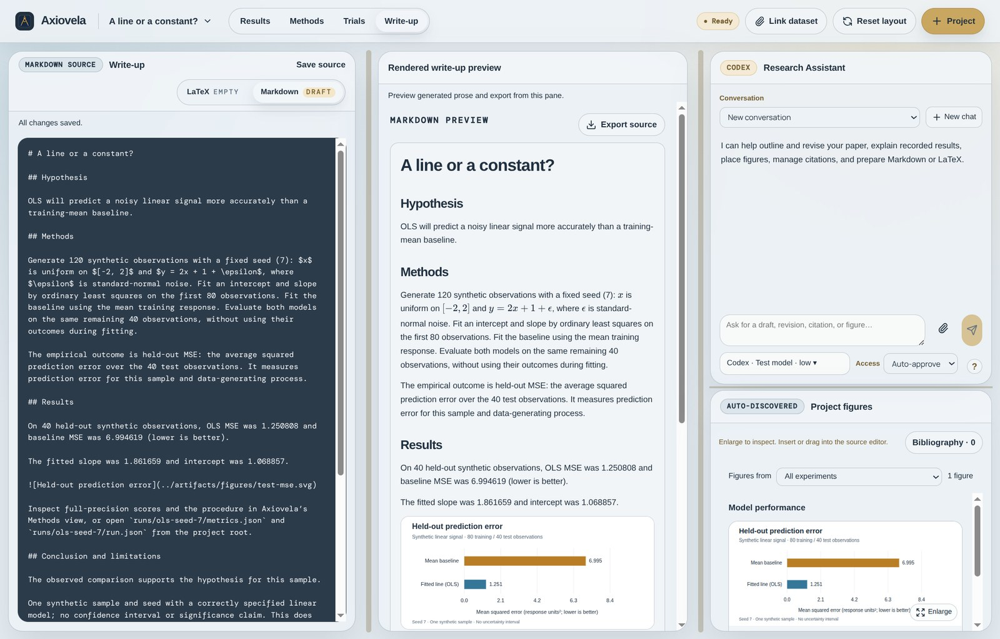

# Demo: research from scratch

[← Home](../README.md) · [Setup](quick-start.md)

For a reproducible first result without an AI account, start with the [Node-only regression example](../examples/linear-regression/README.md). This page covers the optional AI-driven version of the workflow.



The screenshot uses the included synthetic example. Its recorded measurements and manuscript are reproducible without AI access.


*The product workflow from an empty study brief to recorded results and a generated write-up.*

This guided AI demo produces real evidence rather than loading canned results. It requires a configured CLI account; the numerical experiment can use Python's standard library. Model responses and completion time vary.

## 1. Start empty

Create a new `regression-demo` project outside the application checkout. Confirm the panels show guidance and no completed runs. Choose **Auto-approve** to let the assistant write and execute code.

## 2. Give the Experiment Chatbot a bounded task

```text
Build a small reproducible linear-regression experiment in this project.
Use Python 3 and its standard library only: no GPU, model downloads, or paid APIs.
Generate y = 2x + 1 + Gaussian noise with a fixed seed. Fit ordinary least
squares, compare against a mean-only baseline on held-out data, and report
test MSE for both. Write and run tests before the experiment.

Create runs/<run-id>/run.json before starting and update status and progress
while running, using the supplied tracking helper where appropriate. Save
metrics.json and logs beside it. Generate an SVG in artifacts/figures/.
Update workbench.project.json with the question and source entrypoints.
Write writeups/main.md explaining methods, observed results, and limitations.
Do not invent measurements or references. Finish with commands, output paths,
test results, and failures. If Python is unavailable, explain that instead of
silently installing system packages.
```

Expect concise activity updates and a final summary. Verify the files and metrics, not just the completion message. If chat stops at project selection without further activity, use [troubleshooting](troubleshooting.md).

## 3. Inspect the evidence

- **Trials:** recorded status, metrics, and logs. Tiny experiments may finish before intermediate progress is visible.
- **Results:** the saved SVG should appear automatically. The gallery discovers saved figures; it does not generate them from stdout.
- **Methods:** context should describe this study and only its configured infrastructure.
- **Write-up:** select Markdown and compare the rendered report's numbers with run metrics.

If outputs are missing, ask the assistant to inspect the file contract below and correct the paths/schema. Do not rerun just to refresh the UI.

## 4. Render a paper (optional)

With Tectonic installed, ask the Research Assistant:

```text
Convert the observed report to writeups/main.tex as a complete article.
Include the experiment figure, converting it if needed, and load graphicx.
Discuss uncertainty and limitations. Use references.bib only for verified
citations; do not fabricate entries. Preserve main.md. Compile and fix
errors if Tectonic is available.
```

Select LaTeX and press **Render document**. Inspect the full PDF in the middle pane and `exports/main.pdf`. **Bibliography** edits the shared BibTeX file. Use the figure import controls to insert visuals.

## File contract and non-AI check

Figures belong in `artifacts/figures/`; run metadata in `runs/<run-id>/run.json`; numeric results in its sibling `metrics.json`; primary documents in `writeups/main.md` or `writeups/main.tex`. Consult the [tracking helper](../project-template/workflows/workbench_tracking.py) and [run schema](workbench-run.schema.json). Longer training must maintain these records while running.

For deterministic backend verification from the application checkout:

```sh
npm run backend:smoke
```

Use `npm.cmd` on PowerShell. This tests temporary fixtures, not a visible demo in your selected project. It does not establish that arbitrary AI prompts or GPU environments will work.
